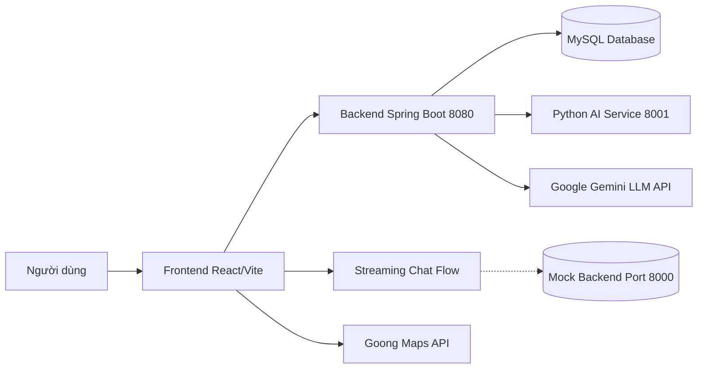
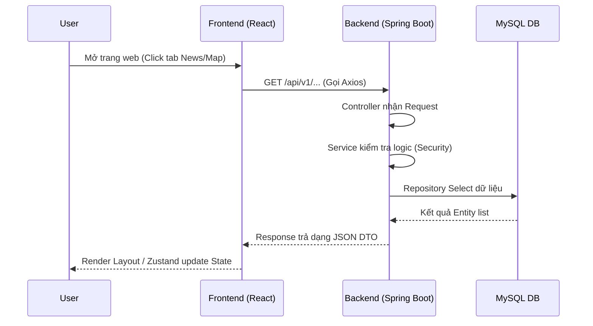
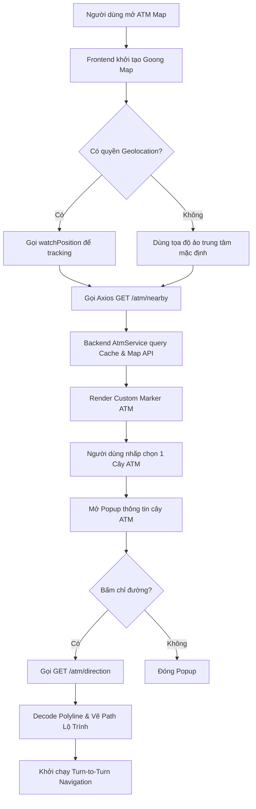
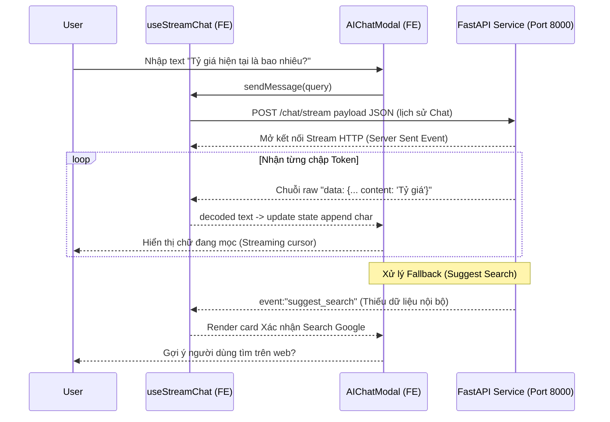

# BÁO CÁO ĐỒ ÁN CHUYÊN NGÀNH
# DỰ ÁN: VIETMONEY ASSISTANT

## 1. Giới thiệu dự án
- **Tên dự án:** VietMoney Assistant
- **Mục tiêu dự án:** Cung cấp ứng dụng hỗ trợ tài chính và du lịch toàn diện, giúp nhận diện tiền tệ, tìm kiếm cây ATM, quản lý ngân sách và lên kế hoạch du lịch nhờ sự hỗ trợ của AI.
- **Bài toán dự án giải quyết:** 
  - Khắc phục sự bất tiện và rủi ro nhầm lẫn/“chặt chém” tỷ giá đối với du khách khi tiêu dùng tại Việt Nam.
  - Khó khăn trong việc tìm kiếm các máy ATM gần nhất để rút tiền mặt khi đi du lịch.
- **Đối tượng người dùng:** Khách du lịch quốc tế và người dùng tại Việt Nam có nhu cầu quản lý chi tiêu.
- **Các chức năng chính của hệ thống:**
  - Quét nhận diện tiền tệ bằng hình ảnh (Camera/Upload).
  - Bản đồ ATM (Tìm kiếm, hiển thị, chỉ đường tới ATM).
  - Quản lý ngân sách (Budget & Transactions).
  - Lên kế hoạch du lịch (Travel Plan, Schedule) bằng AI gen-text.
  - Chatbot AI tư vấn du lịch và tài chính.
  - Bách khoa giá cả (Price Wiki); Tin tức du lịch (News).

## 2. Công nghệ sử dụng
| Thành phần | Công nghệ | Vai trò | Vị trí thư mục |
|---|---|---|---|
| **Frontend** | ReactJS (v18), Vite, Zustand, TailwindCSS | Xây dựng giao diện người dùng, quản lý state và UI/UX tương tác trực quan. | `/frontend` |
| **Backend** | Java 21, Spring Boot (v3.2) | Cung cấp hệ thống REST API, xử lý nghiệp vụ, quản lý Auth và kết nối CSDL. | `/backend` |
| **Database** | MySQL, Flyway | Lưu trữ toàn bộ dữ liệu cấu trúc của hệ thống, quản lý schema migration tự động. | Cấu hình tại `application.yml` |
| **AI Service (Image)** | Python, FastAPI, PyTorch, OpenCV | Cung cấp engine AI xử lý ảnh và nhận diện từng mệnh giá tiền Việt Nam. | `/ai-service` |
| **AI (Text/Planner)**| Spring Boot kết hợp Google Gemini API | Sinh lịch trình du lịch tự động (Itinerary generation) và Data Chatbot. | `/backend/src/../service/GeminiService.java` |
| **Map & Routing** | @goongmaps/goong-js | Hiển thị bản đồ, marker ATM, snap-to-road, chỉ đường, gợi ý địa điểm (Autofill). | `/frontend/src/pages/client/AtmMapPage.jsx` |
| **Auth** | Spring Security, JWT (JSON Web Token) | Hệ thống bảo mật, xác thực người dùng và phân quyền (Admin / User). | `/backend/.../config/SecurityConfig.java` |
| **Realtime / Socket**| WebSocket (@stomp/stompjs) | Quản lý Notification thông báo realtime từ hệ thống đến user. | Hook `nv()` tại frontend. |

## 3. Cấu trúc tổng thể project

Cây thư mục chính yếu của dự án:
```text
vietmoney-assistant/
├── backend/
│   ├── src/main/java/com/vietmoney/        # Logic hệ thống Spring Boot (Controller, Service, Repository, Entity, DTO)
│   ├── src/main/resources/application.yml  # File cấu hình database, cloud, api keys
│   └── pom.xml                             # Quản lý dependencies (Spring Boot, JWT, Flyway, Cloudinary)
├── frontend/
│   ├── src/
│   │   ├── api/                            # Gọi REST API (axiosClient, atmApi, v.v)
│   │   ├── components/                     # Component tái sử dụng (AIChatModal, Navbar)
│   │   ├── pages/                          # Giao diện từng trang (AtmMapPage, v.v)
│   │   └── hooks/                          # Custom Hooks (useStreamChat, v.v)
│   ├── package.json                        # Quản lý thư viện ReactJS
│   └── .env.example                        # Mẫu biến môi trường FE
└── ai-service/
    ├── app/
    │   ├── routers/                        # Controller cho Image API
    │   └── main.py                         # Điểm neo chạy FastAPI
    └── requirements.txt                    # Quản lý thư viện Python (PyTorch, FastAPI, OpenCV)
```

**Giải thích:**
- **`backend/`**: Là trung tâm xử lý dữ liệu chính (Core API) viết bằng Java Spring Boot. Quản lý toàn bộ database, phân quyền người dùng và business logic. Giao tiếp với FE qua chuẩn REST. Điểm chạy chính là hàm `main` ở thư mục gốc Spring Application.
- **`frontend/`**: Ứng dụng Single Page Application (React/Vite). Tương tác với người dùng ở trình duyệt. Cấu hình Entry point ở `main.jsx` và `index.html`.
- **`ai-service/`**: Dành riêng cho tác vụ nhận dạng ảnh AI (Computer Vision). Module này tách biệt vì dùng thư viện Python (PyTorch) tối ưu hiệu năng Tensor hơn Java.
- **Database & Config**: Cấu hình MySQL nằm tại backend `application.yml` và `.env` frontend.

## 4. Kiến trúc hệ thống
Hệ thống theo mô hình Microservices tinh gọn và API-first.



**Hoạt động:**
- **Frontend và Backend**: Giao tiếp chủ yếu qua REST API sử dụng HTTPS/HTTP. Mọi request cần quyền đều được Frontend đính kèm JWT (lưu qua LocalStorage) lấy từ lúc Đăng nhập.
- **Database**: Backend Java dùng Hibernate (JPA) và Flyway để đọc/ghi với MySQL.
- **AI Service (Camera)**: Frontend đẩy request quét tiền về Backend, Backend forward file ảnh xuống FastAPI Python (port 8001) qua HTTP để xử lý rồi lấy Result trả về Frontend.
- **LLM/API (Travel / Chat)**: Khi lên lịch trình, Backend Spring Boot gọi `GeminiService` tương tác trực tiếp tới API Google Gemini LLM để lấy dữ liệu dạng Map/Json.
- **Bản đồ**: Frontend gọi trực tiếp `Goong Maps` SDK để render Tile/Bản đồ. Backend hỗ trợ một phần API ATM nội bộ.

## 5. Flow hệ thống toàn dự án

### 5.1 Flow khởi động hệ thống
- **Backend (Spring Boot):** Bật MySQL database trước. CD vào thư mục `backend`, chạy lệnh `mvn spring-boot:run`. App sẽ load từ `application.yml`, tự động chạy Flyway init Database tables trên cổng `8080`.
- **Frontend (ReactJS):** Chạy lệnh `npm run dev` trong màn hình bash trỏ về `frontend`. Load biến môi trường ở `.env` rồi phục vụ app tại `http://localhost:5173`.
- **AI Service (Python):** Tạo virtual env (`venv`), cài `requirements.txt` và chạy `uvicorn app.main:app --port 8001`.

### 5.2 Flow người dùng truy cập web



### 5.3 Flow đăng nhập/xác thực
- API Đăng nhập nằm tại `AuthController.java` (`POST /auth/login`).
- Request Data: `username` và `password`.
- Backend so sánh password băm qua `Spring Security` (Bcrypt).
- JWT (Access token + Refresh token) được tạo qua `JwtUtils` class trong utils.
- Frontend nhận token qua trả về, lưu vào `localStorage`. Các request sau, `axiosClient.js` tự intercep thêm Header `Authorization: Bearer <token>`.
- **Hết hạn Token:** `axiosClient.js` tại FE phát hiện `HTTP 401`, đưa request vào hàng đợi và tự động gọi `/auth/refresh-token` bằng `refreshToken`, nếu hợp lệ tiếp tục luồng, nếu hết hạn đá người dùng ra trang Đăng nhập.

### 5.4 Flow dữ liệu chính trong hệ thống
Các Entity cốt lõi (Xem cụ thể ở package `domain/entity` của Cấu trúc backend):
- **User / Auth:** `User`, `RefreshToken`, `UserFollow`. 
- **Tin tức xã hội:** `Article`, `ArticleComment`, `ArticleLike`, `SavedArticle`.
- **Tài chính/Ngân sách:** `Budget`, `Category`, `Transaction`.
- **Du lịch:** `TravelPlan`, `ScheduleItem`, `TouristSpot`.
- **ATM/Map:** `AtmCache`, `SavedAtm`. Caching API từ hãng thứ ba để giảm limit.
- **Giá thị trường:** `PriceWiki`, `PriceHistory`, `PriceRecommendation`.
- **Thông báo:** `Notification` (có Websocket event).

## 6. Các chức năng chính của hệ thống

- **Chức năng Authentication**: Đăng ký, Đăng nhập, Quên mật khẩu, Profile.
- **Articles & News**: Hiển thị bảng tin bài đăng du lịch, like, share, comment. Frontend hiển thị News feed.
- **Travel Planner**: Nhập ngày tháng, budget, yêu cầu và Google Gemini AI sẽ sinh lịch trình ngày tự động (Schedule).
- **Price Wiki**: Đóng góp giá địa điểm để mọi người tránh bị lừa.
- **Scan Tiền Tệ**: Mở Camera web (React Camera thẻ) nhận dạng mệnh giá VNĐ (đẩy qua python chạy AI nhận dạng pattern).
- **ATM Map**: Bản đồ chỉ đường ATM (Phân tích sâu ở dưới).
- **Chatbot AI**: Bot giải đáp trực tuyến.

---

## 7. Chức năng riêng 1: ATM MAP
*(Chức năng phụ trách chính - Trình bày sâu)*

### 7.1 Mục tiêu chức năng ATM MAP
- Trang ATM Map hỗ trợ khách du lịch hoặc người dân nhanh chóng nắm bắt vị trí cây ATM hoặc ngân hàng gần nhất trong tầm vi hoạt động.
- Trợ giúp chỉ đường với bản đồ trực quan ngay trên luồng quy trình app, không cần di chuyển người dùng sang Google Maps native, giữ chân khách hàng.

### 7.2 Công nghệ sử dụng trong ATM MAP
| Thành phần | File liên quan | Vai trò |
| --- | --- | --- |
| **Goong Maps SDK** | `@goongmaps/goong-js` (trên Package FE) | Core SDK load tile map Việt Nam, siêu mượt, xử lý gesture chỉ đường tương đồng GG Maps. |
| **Navigator API** | Trình duyệt Web (Geolocation API) | Lấy `coords` (Tọa độ người dùng) liên tục trên di động/máy tính với tính năng `watchPosition`. |
| **Spring Boot ATM**| `AtmController.java`, `AtmService.java` | Proxy trung gian lấy dữ liệu ATM/POI, phân loại dữ liệu (Vietcombank, Techcombank,...), và có Caching `AtmCache`. |
| **Frontend Map UI**| `AtmMapPage.jsx` | File khổng lồ (>1500 lines) quản lý logic Map, Markers, State tuyến đường (Route). |
| **Axios API**| `atmApi.js` | Kho tài nguyên FE để gọi getNearby, getDirection, etc. |

### 7.3 Cấu trúc code chức năng ATM MAP
- **Frontend**: Component chủ đạo tại `frontend/src/pages/client/AtmMapPage.jsx`. Gọi routing xử lý tại `frontend/src/api/atmApi.js`.
- **Backend API Config**: Khóa API Goong đặt tại `application.yml` (`app.goong.api-key`).
- **Backend Class**: `AtmController.java` điều hướng Request. 
- **Backend Service**: `AtmService.java` xử lý chia Grid Caching (Tìm kiếm bán kính 3000m, query tên ngân hàng chuyên dụng) tránh bị Rate limit API.
- **Database**: Bảng `AtmCache` lưu lại dữ liệu cây ATM từng khu vực dưới dạng Cell để load nhanh.

### 7.4 Flow chức năng ATM MAP



### 7.5 Logic xử lý chính của ATM MAP
- **Khởi tạo và Render**: Khởi chạy trong `useEffect`, mount `goongjs.Map`. Render custom Marker nhờ thuộc tính thẻ `DIV` HTML svg icons.
- **Xử lý Vị Trí (Gps Smooth)**: Xử lý dao động tọa độ người dùng thông qua hàm `smoothGps(bufRef, rawLng, rawLat)` tại FE để định vị điểm mượt hơn như điện thoại native.
- **Data ATM**: Lấy list ATM bằng `loadAtms`. `AtmService.java` ở BE dùng thuật toán quét Cell Grid theo vĩ tuyến lân cận để query ra tất cả tên thương hiệu ngân hàng lớn, thay vì thả trôi cho Map tự quyết => Độ phủ kín bản đồ rất cao.
- **Chỉ đường (Rerouting)**: FE có thuật toán Snap To Road (`snapToRoad`) giúp neo marker vào tuyến đường gần nhất (bằng công thức toán logic đường chuẩn) mặc dù GPS dao động.

### 7.6 API liên quan ATM MAP

| Method | Endpoint | Mục đích | Controller Xử lý |
| ------ | -------- | -------- | ---------- |
| GET | `/api/v1/atm/nearby` | Tìm kiếm ATM gần bán kính lat/lng. | `AtmController.java` |
| GET | `/api/v1/atm/{id}` | Lấy chi tiết cây ATM. | `AtmController.java` |
| GET | `/api/v1/atm/direction` | Lấy lộ trình đường đi. | `AtmController.java` |
| GET | `/api/v1/atm/autocomplete` | Tìm kiếm text Autocomplete box. | `AtmController.java` |
| POST | `/api/v1/atm/save` | Lưu một cây ATM vào mục Yêu thích. | `AtmController.java` |

### 7.7 Các vấn đề đã xử lý trong ATM MAP
- **Lỗi Icon Map của Goong-JS**: Thiếu "poi-tree" tile gây crash map error (`styleimagemissing`). Phía FE đã Fix bằng cách tự động cung cấp 1 buffer bit rỗng Image fake trong Event `styleimagemissing` để triệt tiêu Exception Log rác.
- **CORS & Key Expose**: Các key Goong nhạy cảm ở phần GET API (tìm đường, place) được đưa xuống Backend để Call, che đậy khóa API không lộ lọt ra môi trường Client của trình duyệt.
- **Giới hạn lượng quét API của bên thứ 3**: Service Backend phát triển Logic `AtmCache`. Quét grid ô theo tọa độ. Nếu ô tọa độ đó đã được tìm trước đây thì Map trả thẳng Cache Data của ATM từ DB lên, không tốn limit request của hãng.

### 7.8 Tóm tắt phần thuyết trình ATM MAP (Dành cho Slide/Nói)
"Chào các thầy cô, sau đây em xin trình bày luồng ATM Map do em phát triển. Một vấn đề phổ biến của du khách là không biết cây ATM ở đâu khi hết tiền. Em đã sử dụng thư viện mạnh mẽ Goong Map JS kết hợp Geolocation. Khi mở trang, web tự bắt tọa độ 4G hoặc Wifi, kéo API từ backend theo lưới Grid Cache để đảm bảo hiển thị ATM trong 3km mà không bị chậm hay đạt limit. Điểm đặc biệt của Map này là em đã code thuật toán Smooth GPS và Snap-to-Road, khi người dùng bấm chỉ đường, GPS sẽ tự neo sát vào đường đi y hệt như đang dùng Google Map App, vô cùng mượt mà. Hệ thống cũng tự động bóc tách từng Ngân hàng và gắn màu sắc nhận dạng thương hiệu giúp người dùng nhìn phát biết ngay đâu là Techcom, đâu là Vietcombank."

---

## 8. Chức năng riêng 2: Chatbot AI
*(Chức năng phụ trách - Hiện tại có trên Local Frontend)*

### 8.1 Mục tiêu chức năng Chatbot AI
- Trợ lý AI đắc lực cho app VietMoney để hỏi đáp tỷ giá, mẹo tài chính và kế hoạch du lịch không cần thoát app.
- Chatbot là mô hình tư vấn giao tiếp trực tiếp streaming, rút gọn việc tìm hiểu bài viết thủ công dài dòng.

### 8.2 Công nghệ sử dụng trong Chatbot AI
- **Giao diện FE**: Custom React Chat Modal dạng cửa sổ nổi, không gián đoạn tương tác web. Hỗ trợ hiển thị Streaming Cursor từng chữ một theo thời gian thực (SSE/Stream Response).
- **Hooks logic**: Gọi API Endpoint bằng Web Fetch Streaming `ReadableStream` decoding.

| Thành phần | Công nghệ/File | Vai trò |
| ---------- | -------------- | ------- |
| **Chat Component**| `AIChatModal.jsx` | Hiển thị bong bóng Chat, Avatar BOT/USER, Suggest box tìm kiếm. |
| **Logic & Stream**| `useStreamChat.js` | Chạy Web Fetch Stream xử lý event SSE (Server-Sent Events) ghép từng từ. |

### 8.3 Cấu trúc code Chatbot AI
- Code phía client: 
  - `frontend/src/components/layout/AIChatModal.jsx` (UI tổng, Bubble Chat).
  - `frontend/src/hooks/useStreamChat.js` (Luồng logic Stream, Abort Request).
- **Lưu ý trong Source code báo cáo:** Phần Backend Router phục vụ API stream chat (`/chat/stream`) có khả năng được định tuyến ở một Server FastAPI độc lập chạy ở `localhost:8000` *(Theo biến `VITE_AI_SERVICE_URL`).* Trong Source Java BE và AI-Service Image chưa tích hợp API Chat trực diện. Bot trên máy móc local phục vụ demo.

### 8.4 Flow tổng thể Chatbot AI



### 8.5 Logic xử lý chính của Chatbot AI
- FE dùng cơ chế Native File Stream: `res.body.getReader()` để lắng nghe Response stream. Cắt `TextDecoder()` theo xuống dòng `\n`.
- Các State Data sự kiện SSE từ Backend: 
  - `token`: Append chữ vào khung chat.
  - `suggest_search`: Server báo không đủ dữ liệu nội suy tại chỗ, hiển thị thẻ Popup để user chấp nhận "Web Search".
  - `sources`: Link tham chiếu RAG (nếu có).
  - `error`: Render Warning UI.
- Quản lý mảng Lịch sử chat (Context Buffer) đẩy lại Backend mỗi Submit để LLM giữ trí nhớ hoàn cảnh giao tiếp.

### 8.6 API liên quan Chatbot AI (Tương lai/Đang dùng)

| Method | Endpoint | Mục đích | 
| ------ | -------- | -------- | 
| POST | `/chat/stream` | Stream câu hỏi của user và history, trả lời text token. |
| POST | `/chat/confirm-search` | Xác nhận Bot gọi Google Search lấy data Live. |

### 8.7 Ưu điểm và hạn chế của Chatbot AI hiện tại
- **Ưu điểm**: 
  - Code FE UI Chat xuất sắc! Hỗ trợ Stream Typewriter cho cảm giác mượt, nhanh so với chat cục bộ. Hỗ trợ huỷ (AbortRequest) khi đang streaming nửa chừng. 
  - Có luồng Fallback Web Suggest Search khi bot không hiểu.
- **Hạn chế / Rủi ro**: 
  - Source Code Backend cho phần RAG/Langchain Stream chưa tìm thấy đầy đủ trong cụm Deploy public hiện tại, cần một server chạy port 8000 hoặc gọi Gemini API stream trực tiếp từ Java (Java SpringBoot code chỉ mới xài Gemini cho việc Plan Scheduler).
- **Hướng cải tiến**: Mở rộng Chat API sang Service Backend Java, móc WebSockets hoặc WebFlux.

### 8.8 Tóm tắt phần thuyết trình Chatbot AI
"Tiếp nối tính năng về tiện ích mở rộng, em đã cung cấp thêm Công cụ Trợ lý Chat AI. Đặc biệt, nó không phản hồi cục bộ theo kiểu đợi LLM Generate xong 10 giây mới hiển thị cục tin nhắn làm khách hàng sốt ruột, mà em đã ứng dụng kỹ thuật SSE - Server Sent Events vào Hook React. Do vậy khi Bot nói, chữ được truyền qua Stream TCP và load nhảy từng chữ giống y hệt như chatGPT giao diện chính thức. Ngoài ra, Bot cũng có trí thông minh kiểm chứng dữ liệu, nếu không đủ Data nội bộ, nó sẽ ném Event Suggestion hỏi User có muốn lên Web Crawl thông tin mới nhất không, đảm bảo không suy diễn bịa đặt."

---

## 9. Flow liên kết giữa ATM MAP và Chatbot AI
Hiện tại ATM MAP và Chatbot AI là hai chức năng độc lập về khối View Component, nhưng hoàn toàn có thể phát triển thêm hướng tích hợp Chatbot gợi ý ATM gần nhất.
Tương lai (Hướng phát triển): Người dùng có thể chat *"Cho tôi biết 3 cây Techcombank gần tôi"* -> Chat Bot gọi Tool-Call (FastAPI format) đụng thẳng vào `AtmService.java` -> trả JSON ra prompt và BOT hướng dẫn bằng Text.

---

## 10. Database và dữ liệu
Cơ sở dữ liệu trung tâm là MySQL, sử dụng `Flyway` quản lý Migration (chạy SQL file thuần) và Mapping thực thể qua Spring Hibernate (JPA).

- Chức năng ATM Map dùng `AtmCache` lưu tọa độ theo Grid (Lat/Lng ID) để Bypass Query cho API. Bảng `SavedAtm` đánh dấu cơ sở Point yêu thích.
- Chức năng hệ thống lớn lưu: `User` Auth; các Record giao dịch `Transaction`, `Budget`; kế hoạch `TravelPlan`.
- Các Table liên kết Foreign Key cứng: Ví dụ `ScheduleItem` gắn vào `TravelPlan` (One-To-Many).

---

## 11. API tổng hợp của dự án
Tổng hợp các RestController từ Backend Java Spring Boot:

| Nhóm | Endpoint Khởi Đầu | Chức năng cốt lõi | File xử lý (Controller) |
| ---- | -------- | --------- | ---------- |
| **Auth** | `/api/v1/auth` | Login, Register, Renew Token | `AuthController.java` |
| **User** | `/api/v1/users` | Profile, Update Avatar | `UserController.java` |
| **Admin** | `/api/v1/admin`| Admin dashboard quản trị | `AdminController.java` |
| **Article** | `/api/v1/articles` | Get News / Comment / Like | `ArticleController.java` |
| **Finance** | `/api/v1/transactions` | Quản lý thu chi tiêu | `TransactionController.java` |
| **Travel** | `/api/v1/travel-plans` | Hệ sinh thái Plan Map AI | `TravelPlanController.java` |
| **Location** | `/api/v1/atm` | Goong Cache ATM Map | `AtmController.java` |
| **Price** | `/api/v1/wiki-price` | Tra cứu giá cả, Report | `WikiPriceController.java` |
| **Vision AI**| `/api/v1/scan` | Xử lý ảnh tiền tệ | `ScanController.java` |
| **Noti** | `/api/v1/notifications`| Đọc thông báo Read/Unread | `NotificationController.java`| 

---

## 12. Khó khăn và cách xử lý trong đồ án
Trong quá trình phát triển (đặc biệt các module đã phân tích), team và em gặp phải:
1. **API Key Map / Goong / LLM bị lộ**: 
   - *Nguyên nhân*: Gọi trực tiếp từ Client ReactJS dễ bị hacker chôm Rate-limit.
   - *Xử lý*: Giấu vào `.env` backend, toàn bộ hành trình Map request Fetch đều uỷ quyền cho Controller API nội bộ (như `AtmController`) gián tiếp che chở cho các Key thứ 3.
2. **Crash ứng dụng Map (StyleImageMissing)**: 
   - *Nguyên nhân*: File Config Default Goong js Map lỗi thiếu icon.
   - *Xử lý*: Tiêm sự kiện Inject ArrayBuffer Uint8 1 pixel rỗng tại FrontEnd Map Component vào Event `styleimagemissing`.
3. **CORS trên Browser bảo mật cao / Mobile Debug Local**:
   - *Xử lý*: Dùng Annotation `@CrossOrigin` trên Backend hoặc proxy Vite FE để pass qua giai đoạn localhost check.

---

## 13. Kịch bản Demo thuyết trình

### 13.1 Demo tổng quan hệ thống
1. Truy cập URL website frontend trên Localhost.
2. Form thao tác Đăng ký (đẹp bằng React/Taiwind), Register và Login.
3. Review màn hình Overview/Dashboard tổng kết tiền tài chính.

### 13.2 Demo ATM MAP
1. Vào tab Menu **Bản đồ ATM**.
2. Khi trình duyệt xin quyền định vị -> Click "Allow".
3. Trỏ Map zoom sâu vào vị trí của mình (Có icon User nhấp nháy xanh).
4. Quan sát các Icon Marker Ngân hàng ATM tải lên.
5. Search thanh Input: "Techcombank" -> Bản đồ lọc filter ATM Techcombank.
6. Click vào 1 icon -> Hiện chi tiết cây ATM -> Bấm nút **Chỉ đường**.
7. Bản đồ vẽ Polyline Xanh lá hiển thị tuyến đường đi mượt mà từ người dùng đến nơi đích.

### 13.3 Demo Chatbot AI
1. Bấm nút Bong bóng Chat ngoài lề phải phía dưới website, modal `AIChatModal` mở nổi lên nền.
2. Gõ "Tôi chuẩn bị du lịch Hà Nội, mang bao nhiêu tiền là đủ?".
3. Chat Stream sẽ render từng kí tự ra màn hình, đưa ra gợi ý, mẹo khuyên. Demo chức năng báo lỗi mạng / web search fallback. 

---

## 14. Kết luận và Hướng phát triển
**Tổng kết:** Dự án VietMoney Assistant chứng minh được giá trị hệ sinh thái bao trùm. Vừa có app tài chính cốt lõi, lại vừa tích hợp sâu AI hiện đại từ CV (Computer Vision) đến NLP (Generative AI) giải quyết rào cản tài chính của du khách và người trẻ. Các chức năng nâng cao ATM và Chat là trái tim của sự tiện lợi.

**Hướng phát triển:**
- Gắn AI RAG sâu vào Backend Java hoặc FastAPI Python để lấy Context trực tiếp từ bảng Bách khoa giá cả (`PriceWiki`) -> Trả lời giá cơm bụi realtime.
- Release phiên bản Native Mobile App bằng React Native để truy cập Camera phần cứng và GPS Native mạnh hơn so với HTML5 standard.
- Đưa Module Scan qua TensorRT nâng hiệu năng tốc độ quét.

---

## 15. Script phụ trợ thuyết trình

*(Bản rút gọn lời nói)*
> "Kính thưa Hội đồng, em là [Tên bạn]. Trong dự án VietMoney Assistant này, bên cạnh việc cấu trúc hệ thống vi mô, em vinh dự đảm nhiệm hai module tương tác ngoại lai quan trọng: ATM Map và AI Chatbot. 
> 
> Với hệ thống toàn diện, Flow dữ liệu đi từ FE gọi API thông qua JWT Security sang Java SpringBoot bảo mật và trích xuất với MySQL dưới một quy mô hoàn chỉnh chuẩn Microservices, giao tiếp với engine AI Python chuyên dụng. 
> 
> Với Module Map, em đã xử lý các vấn đề nhức nhối khi xài bản đồ Web App cho Mobile như Delay GPS: Em tích hợp custom Smoothing GPS đệm Point để Map đi sát đường mà không rung giật. Khống chế limit Goong API bằng hệ thống Grid Caching tại Backend. 
> Còn đối với Chatbot, em sử dụng kỹ thuật Server Streaming Events. Nó giúp UX của app cảm giác thời gian thực như xài ứng dụng xịn sò chứ không gây ức chế vì Loading Spinner xoay mòng mòng đợi câu trả lời từ Generative AI. 
> Và đó cũng là cái lõi định hướng User First của đồ án. Cảm ơn Hội đồng lắng nghe."
