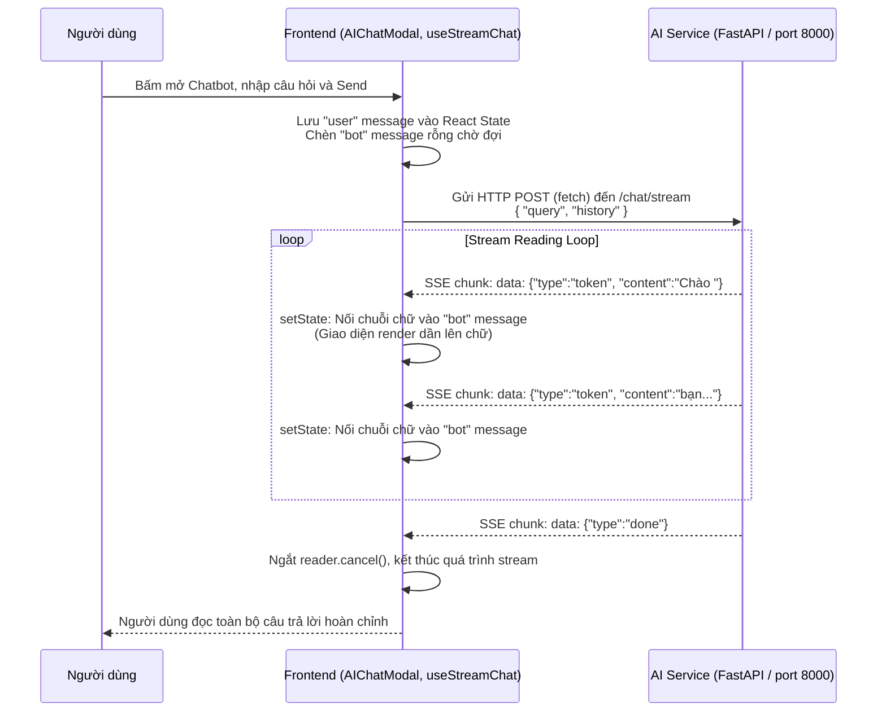
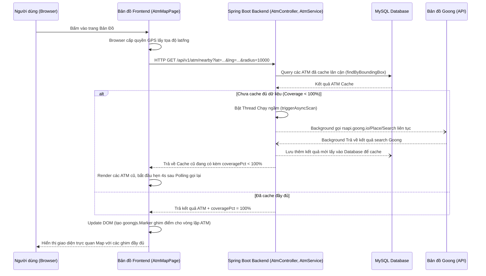

# PHÂN TÍCH FLOW HỆ THỐNG: CHATBOT AI VÀ ATM MAP

Tài liệu này phân tích chi tiết luồng dữ liệu (flow) của 2 chức năng chính trong dự án **VietMoney Assistant**: Chatbot AI và ATM Map, dựa trên source code thực tế hiện tại.

---

## PHẦN 1 — TỔNG QUAN 2 CHỨC NĂNG

- **Chatbot AI dùng để làm gì?**
  Là một trợ lý ảo hỗ trợ trả lời tự động các câu hỏi của người dùng về du lịch, tỷ giá tiền tệ và mẹo tài chính.
- **ATM Map dùng để làm gì?**
  Hiển thị bản đồ dựa trên dữ liệu vị trí địa lý (GPS) của người dùng, giúp dò tìm, hiển thị vị trí các cây ATM/Ngân hàng gần nhất, và hỗ trợ chỉ đường, hiển thị thông tin ATM (đang mở/đóng, khoảng cách).
- **Vị trí trong hệ thống:** 
  - Chatbot AI nằm chủ yếu ở Frontend (`AIChatModal.jsx`, `FloatingPopup.jsx`) và kết nối trực tiếp đến một dịch vụ AI độc lập (thông qua SSE - Server Sent Events).
  - ATM Map nằm ở Frontend (`AtmMapPage.jsx`) làm nhiệm vụ hiển thị giao diện bản đồ (dùng Goong Maps), còn Backend (Java Spring Boot) đóng vai trò proxy gọi API từ Goong và lưu cache dữ liệu ATM.
- **Tính liên kết:** 
  Hai chức năng này **độc lập hoàn toàn** với nhau trong source code. Chúng không chia sẻ trực tiếp dữ liệu hay gọi API của nhau.

---

## PHẦN 2 — FLOW CHATBOT AI

### 2.1 Mục tiêu chức năng Chatbot AI
- **Nhập câu hỏi:** Người dùng nhập câu hỏi tại thanh input của component `AIChatModal.jsx` trên trang web.
- **Gửi API:** Câu hỏi được frontend fetch trực tiếp thành request dạng HTTP POST đến endpoint của AI Service.
- **Xử lý:** Mặc dù AI Service có trong máy (port 8000), nhưng trong source code `ai-service/app/main.py` hiện tại *chỉ gọi các model nhận diện ảnh, chưa tìm thấy code định nghĩa endpoint `/chat/stream`*. Do đó quá trình backend xử lý AI đang được giả định là chạy trên một tiến trình FastAPI khác (hoặc backend khác không nằm trong repo này).
- **Trả về:** Câu trả lời được stream (SSE) trả về từng cụm từ (token) chứ không đợi nguyên câu, giúp tạo hiệu ứng typing mượt mà.

### 2.2 File liên quan Chatbot AI

| Tầng | File/Class/Hàm | Vai trò |
|---|---|---|
| Frontend | `frontend/src/components/layout/AIChatModal.jsx` | Hiển thị giao diện hộp thoại Chatbot, message bubble. |
| Frontend API | `frontend/src/hooks/useStreamChat.js` | Hàm `startStream` dùng `fetch()` gọi API và bắt các luồng stream trả về. |
| Backend Controller | Chưa tìm thấy trong source code hiện tại | Backend Java (Spring Boot) không đứng ra xử lý hay chuyển tiếp luồng chat này. |
| Backend Service | Chưa tìm thấy trong source code hiện tại | Java Service không tham gia vào luồng. |
| AI Service | API `http://localhost:8000/chat/stream` (Lưu ý: *Chưa tìm thấy source code thật sự tạo endpoint này trong thư mục /ai-service* hiện hành) | Chịu trách nhiệm nhận câu hỏi và sinh câu trả lời bằng LLM. |
| Config | `frontend/.env` (`VITE_AI_SERVICE_URL`) | Chứa cấu hình URL base của AI Service. |

### 2.3 Phân tích Flow Chatbot AI chi tiết

1. **Người dùng nhập câu hỏi ở đâu?** Ở component `AIChatModal.jsx` trong popup hiển thị qua click ở `FloatingPopup.jsx`.
2. **Khi bấm gửi, hàm nào được gọi?** Hàm `handleSend()` trong `AIChatModal.jsx` được gọi, tiếp tục gọi hàm `sendMessage(input)` đóng gói phía dưới hook `useStreamChat.js`.
3. **Frontend gọi API bằng axios/fetch ở file nào?** Trong hook `useStreamChat.js` (dòng 44), Frontend dùng trực tiếp hàm gốc `fetch(url, { ... })` để gọi API (không dùng axios do axios không hỗ trợ tốt việc đọc luồng stream chunk by chunk của fetch native).
4. **Request gửi đi bao gồm những field nào?** 
   - `query`: Câu hỏi mới nhất của người dùng.
   - `history`: Danh sách lịch sử các đoạn chat trước (có field `role` và `content`) để làm bộ nhớ ngữ cảnh.
5. **Endpoint backend (AI Service) là gì?** `/chat/stream` hoặc `/chat/confirm-search` (URL đầy đủ thường là `http://localhost:8000/chat/stream`).
6. **Backend controller nào nhận request?** Chưa tìm thấy controller nhận request này trong Spring Boot vì request đẩy thẳng sang cổng 8000 của AI Service.
7. **Backend có xử lý gì trước khi gửi sang AI không?** Về phía Frontend, logic chỉ filter bỏ đi các message tạm (như suggestSearch) trong `buildHistory`, ngoài ra không thấy token logic cho người dùng ở bước gửi message này.
8. **Backend gọi AI service bằng cách nào?** Frontend gọi thẳng đến AI Service mà không vòng qua Backend.
9. **AI service nhận câu hỏi ở endpoint nào?** `/chat/stream`.
10. **AI service trả về format gì?** Dữ liệu stream từ server theo cấu trúc `Server-Sent Events (SSE)`. Cụ thể chuỗi text chứa `data: {"type":"token", "content":"hi"}` hoặc `data: {"type":"error"}`...
11. **Backend trả response về frontend như thế nào?** Luồng streaming trả về chunks dữ liệu (ReadableStream) liên tục.
12. **Frontend cập nhật UI ra sao?** Trong `useStreamChat.js`, vòng lặp `while(true)` kết hợp `reader.read()` đọc từng mảng chunk được decode UTF-8. Nếu `event.type == 'token'`, Frontend lập tức nối đoạn text này vào `content` của bot message cuối cùng (`setMessages(prev => ...)`). Trạng thái (React state) thay đổi kéo theo giao diện của `AIChatModal` re-render và sinh ra hiệu ứng chữ gõ từng ký tự chân thật.
13. **Có loading, error, streaming, retry không?** 
    - Có streaming (`isStreaming` state kết hợp icon loading `StreamCursor`).
    - Gặp lỗi bắt qua `catch (err)` và trả `event.type == 'error'` in dòng cảnh báo: `⚠️ Không thể kết nối đến server.`.
    - Có abort controller giúp user chủ động Stop Streaming (`abortRef.current?.abort()`).
    - Nút confirm cho phép server hỏi lại nếu cần fallback sang dùng tính năng Tìm kiếm Web mới (Suggest Search mode).

### 2.4 Sơ đồ flow Chatbot AI

---

## PHẦN 3 — FLOW KẾT NỐI BẢN ĐỒ ATM (ATM MAP)

### 3.1 Mục tiêu chức năng ATM Map
Chức năng này giúp hiển thị giao diện bản đồ khu vực bằng thư viện Goong JS. Hệ thống thu thập tọa độ (GPS) từ người dùng (nếu cho phép) hoặc tọa độ tĩnh gốc. Sau đó tải các địa điểm điểm đặt ATM/Ngân hàng gần nhất trong giới hạn bán kính khoảng cách, ghim (marker) các địa điểm đó trực quan lên bản đồ kèm thông tin.

### 3.2 File liên quan ATM Map

| Tầng | File/Class/Hàm | Vai trò |
|---|---|---|
| Frontend | `frontend/src/pages/client/AtmMapPage.jsx` | Hiển thị bản đồ (GoongMap SDK) và vẽ các icon ATM. Lấy tọa độ GPS. |
| Frontend API | `frontend/src/api/atmApi.js` | Hàm `getNearby`, `getAutocomplete` dùng cấu trúc Axios để giao tiếp. |
| Backend Controller| `backend/.../controller/AtmController.java` | `/api/v1/atm/nearby` nhận request API từ frontend gọi tới. |
| Backend Service | `backend/.../service/AtmService.java` | Xử lý dữ liệu cache trong DB (`atmCacheRepository`), scan gọi chéo sang Goong (rsapi.goong.io). |
| APIs ngoài | Goong Map Services | Place Search API, Direction, Routing. |
| Config | `frontend/.env` (`VITE_GOONG_MAPTILES_KEY`), SpringBoot prop `app.goong.api-key` | Cấu hình Map token. |

### 3.3 Phân tích Flow ATM Map chi tiết

1. **Người dùng bắt đầu từ đâu?** Mở trang tính năng Bản Đồ (`AtmMapPage.jsx`).
2. **Frontend xử lý định vị:** File `AtmMapPage.jsx` ngay ban đầu dùng Hook `useEffect` gọi hàm `navigator.geolocation.watchPosition(...)` (dòng 640) của trình duyệt. 
3. **Gọi API lấy ATM gần nhất:** Sau khi có thông số kinh nghiệm/vĩ độ (lat/lng), Frontend gọi hàm `atmApi.getNearby(lat, lng, searchRadius)`.  Ví dụ request đi: `lat=21.0285, lng=105.8542, radius=10000`.
4. **Backend tiếp nhận:** Request rơi vào Controller: `AtmController.java` qua HTTP GET `/api/v1/atm/nearby`.
5. **Logic xử lý của Backend (AtmService):**
   - **Check DB Local (Cache):** `AtmService` sẽ tính toán ô lưới (Grid cells coverage) (dòng 190). Query Database (Bảng `AtmCache` thông qua `findByBoundingBox`) để đo khoảng cách Haversine và lấy ra tất cả ATM lưu trong DB. (Hàm `getFromDb` - Dòng 366). Dữ liệu này trả ngay cho Frontend để render tức khắc.
   - **Bg Scan Logic (cực kỳ độc đáo):** Nếu khu vực vùng tìm kiếm là khu vực mới (chưa quét - `ScannedRegion` không tồn tại hoặc hết hạn 72 tiếng TTL), Backend chủ động **bật một Luồng chạy ẩn (Luồng Async Background)** bằng hàm `triggerAsyncScan`.
   - **Gọi External Goong API:** Tại luồng Async quét này, Java gọi `rsapi.goong.io/Place/Search` (Có kết hợp Semaphore đếm tải `Token Bucket` chống quá giới hạn rate limit). Dữ liệu JSON quét được sẽ ngay lập tức được chèn/cập nhật vào Database (`saveAtmCacheBatch`).
6. **Trả về response & Cập nhật UI:** Payload trả cho Frontend mang thuộc tính `coveragePct`, nếu coverage < 100%, Frontend tự động kích hoạt chế độ **Polling** (`pollTimerRef`), liên tục fetch lại dữ liệu sau khoảng 4 giây khi Backend đã tự động quét xong đưa vào DB.
7. **Frontend xử lý Marker:** Nhận mảng dữ liệu. Chạy vòng lặp array, hàm `createAtmMarker` tạo các DOM Element màu xanh lá/đỏ (tùy vào ATM mở hay đóng), và dính nó vào Goong Map Interface (`new goongjs.Marker({ element: el }).setLngLat([atm.lng, atm.lat]).addTo(gMapRef.current)`).
8. **Chỉ đường (Routing):** Khi user bấm "Tìm đường" ở UI, Frontend gọi hàm direction của Backend (đóng vai trò proxy gọi sang Goong Direction Server) trả về tập hợp các điểm Array tọa độ (Decode Polyline - hàm `decodePolyline(encoded)`), và vẽ route overlay lên bản đồ (dòng 719 cấu hình `addLayer`).

### 3.4 Các hàm cốt lõi xử lý Logic Backend (`AtmService.java`)

1. **`getNearbyAtms(lat, lng, radius)`**:
   - Đây là hàm chính xử lý request tìm kiếm quanh vị trí người dùng.
   - Hàm sử dụng thuật toán chia lưới (*Grid cell*) bằng `getCellsForRadius` để xác định các khu vực có nằm trong bán kính tìm kiếm không.
   - Nó kiểm tra cơ sở dữ liệu (`scannedRegionRepository`) xem ô lưới này đã từng được quét chưa, hoặc dữ liệu đã cũ (hết hạn Time-To-Live `CACHE_TTL_HOURS = 72` giờ) hay chưa.
   - Nếu chưa quét hoặc dữ liệu cũ, hàm sẽ kích hoạt tính năng quét bất đồng bộ `triggerAsyncScan`.
   - Bất kể việc quét nền có đang chạy hay không, hàm trả về ngay danh sách ATM có sẵn trong local Database thông qua hàm `getFromDb` (đo và sắp xếp chính xác bằng công thức khoảng cách Haversine).

2. **`triggerAsyncScan` & `scanCell(gridLat, gridLng)`**:
   - `triggerAsyncScan` đẩy nhiệm vụ quét API Goong vào một thread pool (`ExecutorService` luồng chạy ngầm), tránh việc API bị treo (block) thời gian phản hồi ở Frontend.
   - Sử dụng một `ConcurrentHashMap` (`scanInFlight`) làm cờ đánh dấu (lock) để ngăn việc nhiều thao tác của users ở cùng 1 khu vực tạo ra nhiều luồng quét trùng lặp.
   - `scanCell`: Hàm quét trung tâm. Thuật toán sẽ chia nhỏ 1 ô Grid lưới lớn thành 4 ô Sub-Grid (2x2) nhằm gia tăng độ bao phủ. Lặp qua mảng liệt kê các từ khóa ngân hàng lớn (`SCAN_KEYWORDS` như Agribank, MBBank, TPBank...) lồng vào Goong `Text Search API`. Việc chia nhỏ truy vấn này giúp "lách" được cấu trúc giới hạn trả về mặc định chỉ được 10 điểm địa lý của Goong.

3. **`callGoongWithBackoff(url)`**:
   - Hàm giao tiếp vật lý qua internet với Goong API thông qua REST Client (`RestTemplate`).
   - Trang bị bộ bảo vệ Rate Limit (kết hợp `Semaphore` giới hạn thread concurrency và `AtomicInteger` bucket tokens đếm số req/phút).
   - Áp dụng kỹ thuật **Exponential Backoff**: Nếu server API trả về lỗi HTTP 429 Too Many Requests, tiến trình sẽ tạm ngủ lũy tiến (1s, 2s, 4s...) rồi tự động thử lại, đảm bảo hệ thống không bao giờ bị Goong chặn vĩnh viễn và không bị rớt dữ liệu cục bộ.

4. **`saveAtmCacheBatch(atms, gridKey)` & `saveAndMarkCell`**:
   - Ngay sau khi fetch từng gói JSON từ vòng lặp Goong API, các hàm này parse mảng, mapping cấu trúc chuẩn (placeId, name, format lại bankKey bằng thuật toán dò chuỗi `detectBankKey`).
   - Batch insert xuống MySQL Database (`AtmCache` entity). Cơ chế này giúp các phiên request sau (được Frontend Polling sau mỗi 4 giây) có thể ngay lập tức lấy dữ liệu siêu tốc bằng SQL thay vì phải tiếp tục dựa dẫm vào Goong Maps.

### 3.5 Sơ đồ flow ATM Map

